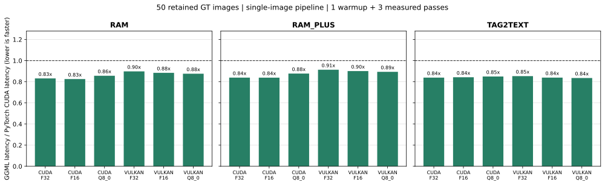
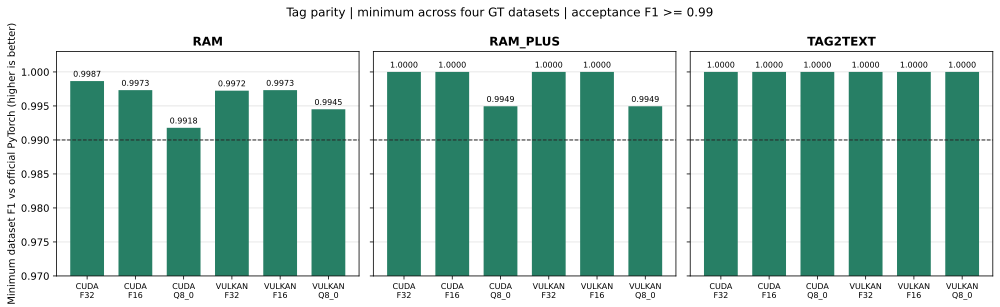
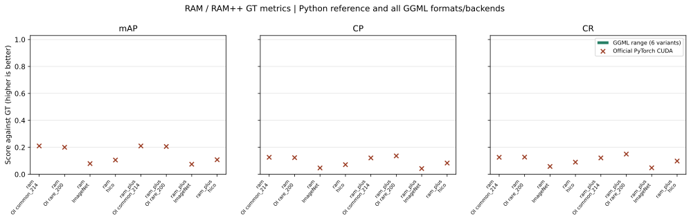
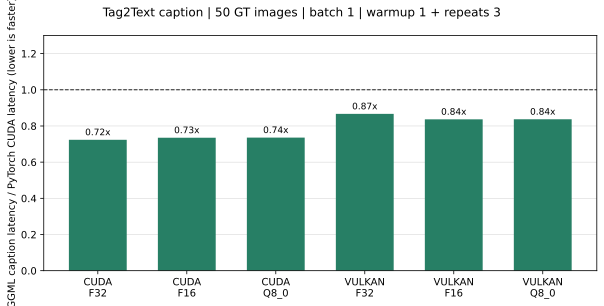
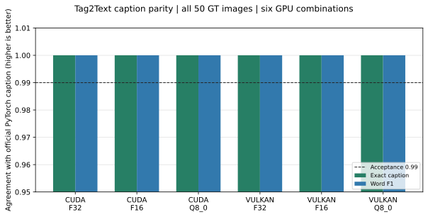
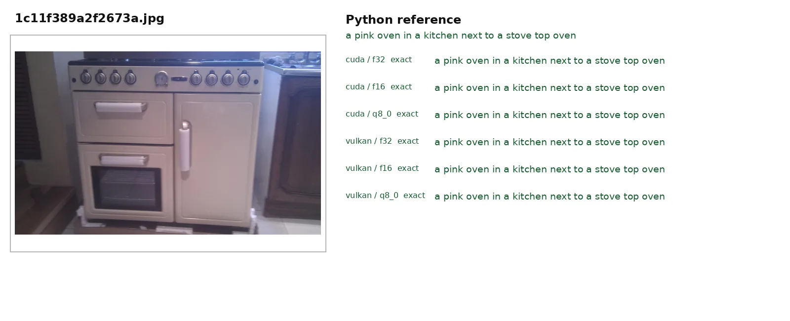
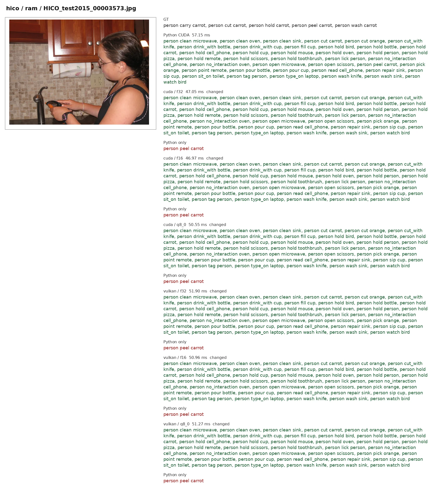

# PyTorch CUDA and GGML latency matrix

Model downloads: [GitHub RAM release](https://github.com/Asher-1/cloudViewer_downloads/releases/tag/RAM) and [Hugging Face RAM_GGUF](https://huggingface.co/Asher-1/RAM_GGUF/tree/main).

Measured on `NVIDIA GeForce RTX 3060 (12 GiB), driver 550.144.03` from `run-20261008-125945`. The retained GT set has 50 images (OpenImages common 14, rare 12, ImageNet multi 12, HICO 12). All three model families, both GPU backends and F32/F16/Q8_0 are represented.

Both engines keep the model resident. Timed work is image decode, resize/normalization, host-to-device transfer, tag inference, host readback and threshold selection. The official PyTorch CUDA baseline uses batch size 1; both engines use one first-image warmup and three measured passes per image. Numbers below are image-count-weighted arithmetic means across the four datasets. Model loading and JSONL serialization are excluded. GGML/PyTorch below 1.00 means GGML is faster. Each timed command passed the GPU compute-process audit; overlap attempts were discarded. Two explicitly allowed resident services and desktop graphics remained present. An idle parent CUDA context coordinates cooperative benchmarks across model-loading gaps. These timings describe this shared workstation, not an uncontended hardware ceiling. Model, executable and source hashes, protocol and audit counts are in [BENCHMARK_METADATA.json](BENCHMARK_METADATA.json).



| Model | Backend | GGUF | PyTorch CUDA ms | GGML ms | GGML/PyTorch | Tag F1 | Minimum dataset F1 | Probability MAE | Slower datasets |
|---|---|---|---:|---:|---:|---:|---:|---:|---:|
| ram | cuda | f32 | 61.11 | 50.81 | 0.832x | 0.9997 | 0.9987 | 0.00011 | 0/4 |
| ram | cuda | f16 | 61.11 | 50.45 | 0.826x | 0.9994 | 0.9973 | 0.00012 | 0/4 |
| ram | cuda | q8_0 | 61.11 | 52.36 | 0.857x | 0.9971 | 0.9918 | 0.00028 | 0/4 |
| ram | vulkan | f32 | 61.11 | 54.89 | 0.898x | 0.9990 | 0.9972 | 0.00010 | 0/4 |
| ram | vulkan | f16 | 61.11 | 54.04 | 0.884x | 0.9994 | 0.9973 | 0.00012 | 0/4 |
| ram | vulkan | q8_0 | 61.11 | 53.53 | 0.876x | 0.9977 | 0.9945 | 0.00028 | 0/4 |
| ram_plus | cuda | f32 | 60.79 | 51.02 | 0.839x | 1.0000 | 1.0000 | 0.00012 | 0/4 |
| ram_plus | cuda | f16 | 60.79 | 51.00 | 0.839x | 1.0000 | 1.0000 | 0.00013 | 0/4 |
| ram_plus | cuda | q8_0 | 60.79 | 53.35 | 0.878x | 0.9988 | 0.9949 | 0.00060 | 0/4 |
| ram_plus | vulkan | f32 | 60.79 | 55.56 | 0.914x | 1.0000 | 1.0000 | 0.00011 | 0/4 |
| ram_plus | vulkan | f16 | 60.79 | 54.78 | 0.901x | 1.0000 | 1.0000 | 0.00013 | 0/4 |
| ram_plus | vulkan | q8_0 | 60.79 | 54.35 | 0.894x | 0.9988 | 0.9949 | 0.00060 | 0/4 |
| tag2text | cuda | f32 | 50.37 | 42.28 | 0.839x | 1.0000 | 1.0000 | 0.00009 | 0/4 |
| tag2text | cuda | f16 | 50.37 | 42.44 | 0.843x | 1.0000 | 1.0000 | 0.00010 | 0/4 |
| tag2text | cuda | q8_0 | 50.37 | 42.81 | 0.850x | 1.0000 | 1.0000 | 0.00018 | 0/4 |
| tag2text | vulkan | f32 | 50.37 | 42.99 | 0.853x | 1.0000 | 1.0000 | 0.00007 | 0/4 |
| tag2text | vulkan | f16 | 50.37 | 42.28 | 0.839x | 1.0000 | 1.0000 | 0.00010 | 0/4 |
| tag2text | vulkan | q8_0 | 50.37 | 42.08 | 0.835x | 1.0000 | 1.0000 | 0.00018 | 0/4 |

## Acceptance

- The 50-image aggregate speed target passes for 18/18 model/backend/format combinations. The strict per-dataset speed target passes for 72/72 rows.
- All 18 aggregate combinations meet the speed target.
- The per-dataset tag parity target (F1 >= 0.99) passes for 72/72 rows; the minimum is 0.991781. Each model/backend/format's minimum is shown alongside its weighted mean.
- All 72 GT rows have `annotation_status=ok`. Tag F1 compares thresholded PyTorch and GGML sets; it is not a GT score. The per-dataset GT `mAP`, `CP`, `CR`, and every individual speed result are in [latency_matrix_72.csv](latency_matrix_72.csv).
- RAM and RAM++ expose tags only. Tag2Text caption decoding is a separate pipeline; tag latency and F1 do not establish caption parity.





The GT chart covers RAM and RAM++. Its green range contains the six GGML backend/format values, with the official Python value shown as a cross. The CSV includes `pytorch_mAP/CP/CR` and GGML-minus-Python differences. Tag2Text's GT scores on rare/ImageNet/HICO are zero-target diagnostics because those datasets do not supply Tag2Text GT; they are excluded from this chart.

The diagnostic report [ALIGNMENT_DIAGNOSIS.md](ALIGNMENT_DIAGNOSIS.md) explains the CUDA activation quantization error, selective RAM Q8 policy, FP32 accumulation, constant caching and Vulkan dispatch/copy reductions. CUDA tagging auto mode uses FP16 matrix inputs with FP32 accumulation/output, including a resident converted matrix cache for F32 GGUF weights. `--cuda-compute f32` selects FP32 inputs.

## Tag2Text image-to-caption

Measured from `caption-20261008-133340` on the same 50 images. Official PyTorch CUDA: **247.82 ms/image**. Both engines keep weights resident, use batch size 1, one first-image warmup and three measured passes per image. Timing includes decode, preprocessing, transfer, tag and text generation, and output readback; model loading and JSONL serialization are excluded. Captions are compared byte-for-byte and with lexical word F1 against Python, not against human GT captions.





| Backend | GGUF | PyTorch CUDA ms | GGML ms | GGML/PyTorch | Exact caption | Word F1 |
|---|---|---:|---:|---:|---:|---:|
| cuda | f32 | 247.82 | 179.31 | 0.724x | 1.000 | 1.000 |
| cuda | f16 | 247.82 | 182.12 | 0.735x | 1.000 | 1.000 |
| cuda | q8_0 | 247.82 | 182.29 | 0.736x | 1.000 | 1.000 |
| vulkan | f32 | 247.82 | 214.82 | 0.867x | 1.000 | 1.000 |
| vulkan | f16 | 247.82 | 207.36 | 0.837x | 1.000 | 1.000 |
| vulkan | q8_0 | 247.82 | 207.44 | 0.837x | 1.000 | 1.000 |

Caption latency is lower for **6/6** GGML combinations. All six combinations meet the requested 0.99 exact-wording target on these 50 frames. Lexical word F1 does not replace exact parity. The machine-readable table is [caption_matrix_6.csv](caption_matrix_6.csv). The ignored raw run keeps all 50 Python and GGML sentences for audit.

The preview below shows a representative source image beside the Python sentence and all six GGML sentences. Generate all 50 full-resolution panels with `visualize_outputs.py`.



All 50 caption panels are indexed in [visualizations/README.md](visualizations/README.md). The 150 model/image tagging panels, including explicit extra/missing tags and GT, are indexed in [visualizations/tags/README.md](visualizations/tags/README.md). Raw panels remain local and ignored; the previews below are tracked.



## Reproduce

```bash
python3 cpp_ggml/benchmarks/full_eval.py --scope datasets --run \
  --backends cuda vulkan --dtypes f32 f16 q8_0 \
  --batch-size 1 --warmup 1 --repeat 3 --threads 8 \
  --label-space-dir cpp_ggml/benchmarks/label_spaces --check-acceptance --wait-gpu-idle
python3 cpp_ggml/benchmarks/caption_all.py --scope datasets \
  --backends cuda vulkan --dtypes f32 f16 q8_0 --warmup 1 --repeat 3 --check-acceptance --wait-gpu-idle
python3 cpp_ggml/benchmarks/latency_matrix.py \
  --run-dir cpp_ggml/benchmarks/full_eval/run-YYYYMMDD-HHMMSS \
  --caption-run cpp_ggml/benchmarks/full_eval/caption-YYYYMMDD-HHMMSS --require-acceptance
python3 cpp_ggml/benchmarks/visualize_outputs.py \
  --caption-run cpp_ggml/benchmarks/full_eval/caption-YYYYMMDD-HHMMSS \
  --preview-output cpp_ggml/benchmarks/caption_examples.webp
python3 cpp_ggml/benchmarks/visualize_tags.py \
  --run-dir cpp_ggml/benchmarks/full_eval/run-YYYYMMDD-HHMMSS \
  --preview-output cpp_ggml/benchmarks/tag_examples.webp
```

Every per-dataset result remains visible in the CSV. The speed result is hardware- and driver-specific and does not prove a universal advantage. On a shared GPU add `--wait-gpu-idle` and repeat `--allow-gpu-pid PID` only for explicitly allowed long-lived services. Every monitored command records process samples; the tagging harness retries commands with detected transient overlap.
